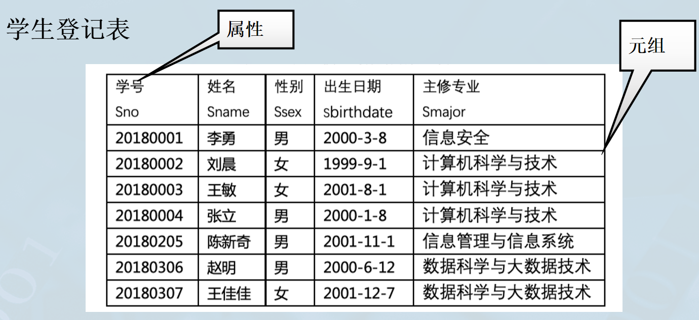
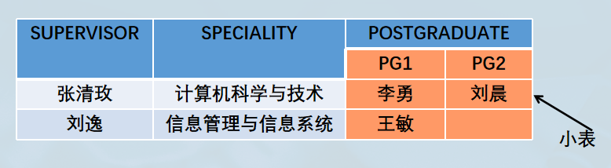

# 数据库系统概论

[TOC]

# 第一章 绪论

## 什么是数据库？

- 本质是数据的集合

- **长期存储** 在计算机内 **有组织** 、 **可共享** 的大量 **数据的集合**

- 按一定的 **数据模型** 组织、描述和存储，具有较小的 **数据冗余** 、较高的 **数据独立性** 和 **可扩展性** ，并可为各种用户 **共享**


### 数据冗余

- 数据冗余指 **同一份数据在多个不同地方存储** ，比如我们的基本信息在学校、医院、公安、银行等多个信息系统存储，甚至同一个信息系统（比如微人大）中也会多次存储同一个信息（姓名）。

- 数据冗余可能导致数据的不一致，存储空间的浪费，更新操作复杂等问题；但冗余也可以便利查询操作、增加安全性。

## 数据模型

- 数据模型是对现实世界数据特征的抽象，是 **现实世界的模拟**

- 数据模型是用来描述数据、组织数据和对数据进行操作的

- 数据模型是数据库系统的 **核心和基础**

  > XX数据库，一般“XX”都是数据模型，比如层次/网状/关系/KV/图 等等
  >
  > 近年来， **多模数据库** （multi-model database system）逐渐成为研究热点，如OrientDB，ArangoDB

- 数据建模的过程： **两步抽象** 
  - 将现实世界中的客观对象抽象为 **概念模型** （将现实世界抽象为信息世界）
  - 将概念模型转换为某一数据库管理系统（DBMS）支持的 **数据模型** （将信息世界转换为机器世界）

### 概念模型

- 信息世界中的基本概念
- 概念模型的一种表示方法： **实体-联系方法（Entity-Relationship Approach，E-R方法/E-R模型）** 
  - 实体（entity）：客观存在并可相互区别的事物称为实体
  - 属性（attribute）：实体所具有的某一特性称为属性
  - **码（key）：唯一标识实体的属性集称为码** 
  - 实体型（entity type）：用实体名及其属性名集合来抽象和刻画同类实体称为实体型
  - 实体集（entity set）：同一类型实体的集合称为实体集
  - 联系（relationship）：现实世界中事物内部以及事物之间的联系在信息世界，实体之间的联系有一对一、一对多和多对多等多种类型


- 抽象了学校中的学生和课程两个客观事物：学生实体和课程实体

- 抽象了现实世界中事物之间的联系：
  - 一门课程可以有多名学生选修，一个学生可以选修多门课程
  - 用课程实体与学生实体多对多（m:n）联系来描述

### 数据模型的三要素

#### 数据结构

对系统静态特性的描述。

#### 数据操作

对数据库中各种对象（型）的实例（值）允许执行的 **操作的集合** ，包括 **操作** 及有关的 **操作规则** 。

对系统动态特性的描述。

#### 数据完整性约束 :star2: 

- 一组完整性规则

- 完整性规则：给定的数据模型中数据及其联系所具有的制约和依存规则

- 限定符合数据模型的数据库状态及状态的变化，以保证数据的正确、有效和相容

  > *e.g.* 一个完整性规则的例子：
  >
  > 学生数据中，年龄必须大于0，所学专业必须真实存在，学号应该是10位数且以年份开头

### 层次模型

- 实体用记录表示

- 实体的属性对应记录的数据项（或字段）

- 实体之间的联系转换成记录之间的两两联系

- 数据结构的单位是基本层次联系

  - 是指两个记录以及它们之间的一对多（包括一对一）的联系

    

- 用 **树形结构** 来表示各类实体及实体之间的联系

> 层次模型是数据库系统中最早出现的数据模型。
>
> 典型代表是IBM公司的IMS（Information Management System）。

- 优点

  - 数据结构比较简单清晰

  - 查询效率高

    > 层次模型中记录之间的联系用有向边表示，就是记录之间的存储距离。

  - 提供了良好完整性约束

- 缺点

  - 现实中很多联系是非层次性的

  - 一个节点具有多个双亲节点，只能通过冗余数据或创建非自然的数据结构来解决

  - 对 **插入** 和 **删除** 操作的限制多， **应用程序的编写比较复杂** 

  - **查询子女节点必须通过双亲节点** 

    > 层次模型中，只允许一个节点无双亲节点——根节点。

  - 层次命令趋于程序化（必须按层次、顺序操作）

例如，在企业管理系统中，假如每个公司都表示为一个独立的树形结构，而多个公司没有直接联系，这样的结构就可以通过一个虚拟的“超级根节点”来统一表示：

```bash
超级公司（Super Company）
   └── 公司A（Company A）
       └── 部门1
           └── 员工1
       └── 部门2
   └── 公司B（Company B）
       └── 部门1
           └── 员工2
```

### 网状模型

满足以下两个条件的基本层次联系集合：

- 允许一个以上的节点无双亲
- 一个节点可以有多个双亲

网状模型的表示方法：

- 实体性：用记录类型描述，每个节点表示一个记录类型（实体）
- 属性：用字段描述，每个记录类型可包含若干个字段
- 联系：用节点之间的连线表示记录类型（实体）之间的 **一对多的父子联系** 

网状数据库系统（如DBTG）对数据操纵加限制，提供了一定的完整性约束。

- **码：唯一表示记录的数据项的集合**
- 一个联系中，双亲记录与子女记录之间是一对多的联系
- 支持双亲记录和子女记录之间的某些约束条件

优点：

- 能够更直接地描述现实世界，如一个节点可以有多个双亲，节点之间可以有多种联系
- 具有良好的性能，存取效率较高

缺点：

- **结构比较复杂，** 随着应用环境的扩大，数据库的结构就变得越来越复杂，不利于最终用户掌握

- DDL、DML语言复杂，要嵌入到某一种高级语言中，用户不容易使用

  > **DDL（数据定义语言）**：用于定义网状数据库的结构，包括记录类型、关系和子集等。
  >
  > **DML（数据操作语言）**：用于操作数据库中的数据，包括插入、更新、删除和查询记录及关系。

- 记录之间联系是通过存取路径实现， **用户必须了解系统结构的细节** 

  > 之前提到，网状数据库中的数据通过“边”相互连接，从而形成一个网状结构；要访问某个记录，必须要从已知的记录开始，沿着定义好的路径遍历关系，直到找到目标记录。

### 关系模型 :star2: 

> :calendar: 1970年，美国IBM公司San Jose研究室的研究员E.F.Codd首次提出了数据库系统的关系模型。
>
> :desktop_computer: 1980年代以来，计算机厂商推出的数据库管理系统几乎都支持关系模型。

#### 数据结构

- 从用户观点看，关系模型由一组关系构成

- 每个关系的数据结构是一张 **规范化** 的 **二维表** 

  

几个基本概念：

- 关系（relation）：一个关系对应通常说的 **一张表**

- 元组（tuple）：表中的 **一行** 即为一个元组

- 属性（attribute）：表中的 **一列** 即为一个属性，给每个属性起的名字即为属性名（列名）

- **码（key）** ：又称码键或键。表中的 **某一个/一组属性** ，它的值可以 **唯一确定一个元组** 

- 域（domain）：是一组具有相同类型的值的集合。属性的取值范围来自某个域

- 分量：元组中的一个属性值

- 关系模式：对关系的描述，形如 *关系名（属性1，属性2，...，属性n）*

  > *e.g.* 学生（学号，姓名，性别，出生日期，主修专业）
  >
  > 其中学号是码

关系必须是 **规范的** ，满足一定的规范条件。

最基本的规范条件：关系的每一个分量必须是一个 **不可分** 的数据项， **不允许表中还有表** 

> *e.g.* 下表中的“联系方式”是可分的数据项， **不符合关系模型的要求** 
>
> 

#### 数据操作

关系模型的数据操作是 **集合** 操作，操作对象和操作结果都是 **关系** 。 

操作主要有查询、插入、删除、更新。

#### 关系的完整约束性条件

- 实体完整性
- 参照完整性
- 用户定义的完整性

- [x] TODO：在下一章展开

#### 优点

- 建立在 **严格的数学概念** 的基础上
- 概念单一
  - 实体和实体之间的联系都用关系来表示
  - 对数据的检索和更新结果也是关系
- 关系模型的存取路径对用户是 **隐蔽的** 
  - 具有更高的数据独立性，更好的安全保密性
  - **简化了程序员的工作** 和数据库开发建立的工作

#### 缺点

- 存取路径对用户隐蔽，查询效率往往不如层次模型和网状模型

  > **缺乏控制**：用户无法直接控制查询的执行计划和数据的存取路径，这可能导致某些性能优化的机会被错过。例如，在某些情况下，用户希望使用特定的索引或连接方式来提高查询效率，但数据库系统可能选择了次优的执行路径。
  >
  > **不适合极端优化需求**：在一些高性能计算或数据分析场景下，用户可能需要对数据访问进行非常细粒度的调优，隐蔽的存取路径限制了这种能力。

- 为提高性能，必须对用户的查询请求进行优化，增加了开发数据库的难度

### 数据库领域中不断涌现的数据模型

- 层次模型、网状模型
- 关系模型
- 面向对象数据模型、对象关系数据模型
- 半结构化的XML数据模型
- 新型数据模型
  - 键值对数据模型（Key-Value）
  - 文档数据模型
  - 图数据模型
  - 时序数据模型
  - 时空数据模型
  - 流数据模型
  - 多媒体数据模型
  - ...

---

# 第二章 关系数据库

## 数据结构

- 单一的数据结构——关系：现实世界的 **实体** 以及 **实体间的各种联系** 均用关系来表示
- 逻辑结构——二维表：从用户角度，关系模型中数据的逻辑结构是一张二维表
- 建立在 **集合代数** 的基础上

重温几个基本概念：

- 域（domain）：一组具有 **相同数据类型** 的值的 **集合** 

  > *e.g.* 整数；实数；介于某个取值范围的整数；长度小于25字节的 **变长字符串** 集合；{男，女}；...

- 笛卡尔积

  给定一组域 $D_1, D_2, ... , D_n,$ *允许其中某些域是相同的* ， $D_1, D_2, ... , D_n$ 的笛卡尔积为：

  $D_1 \times D_2 \times ... \times D_n = \{(d_1 ,d_2, ..., d_n)|d_i \in D_i, \ i = 1, 2, ..., n\}$ 

  - 所有域的所有取值的一个 **组合**
  - **不能重复**

- 元组（tuple）： **笛卡尔积中每一个元素** $(d_1, \ d_2, \ ..., \ d_n)$ 叫作一个 $n$ 元组（n-tuple）或简称 **元组** 

  > *e.g.* (张清玫，计算机科学与技术，李勇)、(张清玫，计算机科学与技术，刘晨)  等都是元组 

- 分量（Component）

  - 笛卡尔积元素 $(d_1, \ d_2, \ ..., \ d_n)$ 中的每一个值 $d_i$ 叫作一个 **分量** 
  
    > *e.g.* 张清玫、计算机科学与技术、李勇、刘晨等都是分量
  
- 基数（cardinal number）

  - 一个域允许的不同取值的个数
  - 若 $D_i \ (i=1, 2, ..., n)$ 为有限集，其基数为 $m_i \ (i = 1, 2, ..., n)$ ，则 $D_1 \times D_2 \times .. \times D_n$  的基数 $M$ 为： $M =  \prod_{i=1}^{n} m_i$  


数据库中，笛卡尔积可以表示为一张 **二维表** ，表中的 **每行对应一个元组，每列来自一个域** 。

## 关系

- 关系模型中 $D_1， D_2, ..., D_n$ 的笛卡尔积一般没有实际语义，只有某个真子集才有 **实际含义** 。

几个相关概念：

- 关系： $D_i \times D_2 \times ... \times D_n$ 的 **子集** 叫作在域 $D_1, D_2, ..., D_n$ 上的 **关系** ，表示为 $R(D_1, D_2, ..., D_n)$ 。其中，
  - $R$ ：关系名
  - $n$ ：关系的 **目** 或 **度** （degree）
  
- 元组：关系中的每个元素是关系中的元组，通常用 $t$ 表示

- 单元关系&二元关系
  - 当 $n = 1$ 时，称该关系为 **单元关系** （unary relation）或 **一元关系** 
  - 当 $n = 2$ 时，称该关系为 **二元关系** （binary relation）

- 关系的表示：关系也是一个二维表，表的每行对应一个元组，表的每列对应一个域

- 属性

  - 关系中不同列可以对应相应的域

  - 为了加以区分，必须对每列起一个名字，成为属性（attribute）

  - $n$ 目关系必有 $n$ 个属性

    > *e.g.* **SMP(SUPER,  MAJOR, POSTGRADUATE)** 有3个属性，是一个3目关系；（张清玫，计算机科学与技术，李勇），（张清玫，信息管理与信息系统，刘晨），(刘逸，信息管理与信息系统，王敏) 是**SMP**关系的3个元组
  
- 三类关系

  - 基本关系（基本表或基表）： **实际存在**的表，是实际存储数据的逻辑表示
  - 查询表：查询执行产生的结果对应的**临时表** 
  - 视图表：由基本表或其他视图表导出的**虚表** ，不存储实际数据

- 基本关系的性质

  - 列是 **同质的** （homogeneous）

  - 不同的列可出自同一个域

    - 其中每一列称为一个属性
    - 不同的属性要给予不同的属性名

  - 列的顺序无所谓，可以任意交换

  - 任意两个元组的**码不能相同** 

  - 行的顺序无所谓，可以任意交换

  - 分量必须取原子值，即每一个分量都必须是**不可分的**数据项——这是规范条件中最基本的一条

    例如，下面的**POSTGRADUATE**是错误的分量，因其是可分的，其下存在小表。

    


## 关系模式

关系模式是型，关系是值。

关系模式是对关系的描述：
- 描述关系元组集合的**结构**
  - 属性构成
  - 属性来自的域
  - 属性与域之间的映象关系
- 描述关系的**完整性约束** 

关系模式可以形式化地表示为： $R(U, \ D, \ DOM, \ F)$ ，其中

- $R$ ：关系名
- $U$ ：组成该关系的属性名集合
- $D$ ： $U$ 中属性来自的域
- $DOM$ ：属性向域的映象集合
- $F$ ：属性间数据的依赖关系集合

例如， `导师` 和 `研究生` 出自同一个域：人，

- 取不同的属性名

- 在模式中定义属性向域的映象，即说明它们分别出自哪个域：

  **DOM(SUPERVISOR) = DOM(POSTGRADUATE) = PERSON**

关系模式通常可以简记为 $R(U)$ 或 $R(A_1, A_2, ..., A_n)$ 

- $R$ ：关系名
- $A_1, A_2, ..., A_n$ ：属性名
- 域名及属性向域的映象常常直接说明为属性的 **类型、长度** 

### 一些基本元素

#### 候选码（candidate key）

关系模式中的某**一个或一组**属性的值能**唯一地**标识一个元组，而它的**真子集不能**唯一地标识一个元组，则称该属性或属性组为候选码。

简单的情况：候选码只包含一个属性

> [!CAUTION]
>
> Q：关系中某个属性，在当前所有元组上都不重复，则它一定是候选码吗？
>
> A：不一定，实际上它可能是可以重复的（只是还没出现）。例如，班上同学的姓名不能做候选码（可能重名）。

#### 全码（all-key）

最极端的情况：关系模式的所有属性是这个关系模式的候选码，称为全码（all-key）

#### 主码（primary key）

若一个关系有多个候选码，则选定其中一个为主码（primary key）

> *e.g.* 在导师-研究生关系**SMP(SUPERVISOR, MAJOR, <u>POSTGRADUATE</u>)**中，假设研究生不能重名，则**POSTGRADUATE**可以作为关系**SMP**的主码，用<u>下划线</u>表示

> [!NOTE]
>
> 候选码和主码**都可以**唯一标识一个元组

#### 主属性（prime attribute）

候选码的诸属性称为主属性（prime attribute）

不包含在任何候选码中的属性称为非主属性（non-prime attribute）或非码属性（non-key attribute）

> [!NOTE]
>
> 辨析：关系模式 & 关系
>
> - 关系模式
>
>   - 对关系的描述
>
>   - 静态的、稳定的
>
> - 关系
>   - 关系模式在某一时刻的状态或内容
>   - 动态的、随时间不断变化的
>
> 关系模式和关系往往笼统称为关系，需要通过上下文加以区分。

## 关系操作

- 常用的关系操作
  - 查询操作：选择、投影、连接、除、并、差、交、笛卡尔积
    - 选择、投影、并、差、笛卡尔积是5中基本操作
  - 更新操作：插入、删除、修改
- 关系操作的特点
  - 集合操作方式：操作的对象和结果都是集合， **一次一集合** 的方式
  - 关系操作的所有输入和输出均是关系，包括关系操作的中间结果

## 关系的完整性

关系有三类完整性约束：

- 实体完整性和参照完整性
  - 关系模型必须满足的完整性约束条件，称为关系的 **两个不变性** ，应该由关系系统 **自动支持** 
- 用户定义的完整性
  - 应用领域需要遵循的约束条件，体现了具体领域中的语义约束

### 实体完整性规则（entity integrity）

- 若属性A（一个或一组）是基本关系R的主属性，则A不能取空值
- 空值就是“不知道”或“不存在”或“无意义”的值

> [!NOTE]
>
> :one: 实体完整性规则是针对基本关系而言的，一个基本表通常对应现实世界的一个实体集
>
> :two: 现实世界中的实体是可区分的，即它们具有某种 **唯一性标识** 
>
> :three: 关系模式中以主码作为唯一性标识
>
> :four: 主码中的属性不能取空值。如果取了空值，就说明存在 **某个不可标识的实体** ，即存在不可区分的实体，这与 :two: 相矛盾，因此这个规则称为实体完整性

### 参照完整性规则（reference integrity）

若属性（组）F是基本关系R的外码，它与基本关系S的主码Ks相对应（R和S不一定是不同的关系），则对于R中每个元组在F上的值必须为：

- 空值（F的每个属性值均为空值）
- 等于S中某个元组的主码值

## 关系代数

### 传统的集合运算

### 专门的关系运算

#### 选择（selection）

- 选择又称为限制（restriction）
- 操作对象： **一个关系** 

#### 投影（projection）

#### 连接（join）

两种常用的连接运算：

- 等值连接（equi-join）

  > A，B可以不同，值相同即可（对比自然连接）

- 自然连接（natural join）

  > 没有条件，直接“合并同类列”

---

# 第三章 SQL语言

> 一条SQL语句以分号结尾

> VARCHAR：长度可变，根据实际数据而定
>
> CHAR：定长空间

 

`GROUP BY` :


```SQL
SELECT genre, AVG(budget)
FROM movies
GROUP BY genre;
```

`WHERE` 要在 `GROUP BY` 之前：


> [!NOTE]
> `UNIQUE` 列可以有（多个） `NULL` 值。

---

# 第四章 数据库安全性

遵纪守法。

## 存取控制

### 存取控制机制组成

- 定义用户权限，并将用户权限登记到**数据字典**中
  - 用户对某一数据对象的操作权力称为权限
  - DBMS提供适当的语言来定义用户权限，存放在数据字典中，称作安全规则或授权规则
- 合法权限检查
  - 用户发出存取数据库操作请求
  - DBMS查找数据字典，进行合法权限检查

**用户权限定义** 和 **合法权限检查机制** 一起组成了DBMS的存取控制子系统。

### 常用存取控制方法

- **自主存取控制** （Discretionary Access Control, DAC）
  - C2级
  - 用户对不同的数据对象有不同的存取权限
  - 不同的用户对同一对象有不同的权限
  - 用户可以将其拥有的存取权限转授给其他用户
- **强制存取控制** （Mandatory Access Control, MAC）
  - B1级
  - 每一个数据对象被标以一定的 **密级** 
  - 每一个用户也被授予某一个级别的 **许可证** 
  - 对于任意一个对象，只有具有合法许可证的用户才可以存取

### 自主存取控制方法

- 通过SQL的 `GRANT` 语句和 `REVOKE` 语句实现
- 用户权限组成
  - 数据库对象
  - 操作类型
- 定义用户存取权限：定义用户可以在哪些数据对象上进行哪些类型的操作
- 定义存取权限称为 **授权** 

### 授权：授予&收回

#### `GRANT` 

`GRANT` 语句的一般格式：

```SQL
GRANT <权限>[,<权限>]...
ON <对象类型><对象名>[,<对象类型><对象名>]...
TO <用户>[,<用户>]...
[WITH GRANT OPTION];
```

语义：将对指定操作对象的指定操作权限授予指定的用户。

- 发出 `GRANT` 
  - 数据库管理员（DBA）
  - 数据库对象创建者（即属主owner）
  - 拥有该权限的用户
- 接受权限的用户
  - 一个或多个具体用户
  - `PUBLIC` （即全体用户）

`WITH GRANT OPTION` 语句

- 指定：可以 **再授予**
- 未指定： **不能传播** 

> [!WARNING] 
> *不允许* 循环授权
>
>  

#### `REVOKE` 

授予的权限可以有数据库管理员或其他授权者用 `REVOKE` 语句收回。

`REVOKE` 语句的一般格式为：

```SQL
REVOKE <权限>[,<权限>]...
ON <对象类型><对象名>[,<对象类型><对象名>]...
FROM <用户>[,<用户>]...[CASCADE|RESTRICT];
```

- 指定了 `CASCADE` ，则 **级联收回** 授予的权限
- 指定了 `RESTRICT` ，如果转授了权限，则不能收回
- **默认**值为 `RESTRICT` 

### 数据库角色

角色：被命名的一组数据库操作相关的权限

- 角色是 **权限的集合** 
- 可以为一组具有相同权限的用户创建一个角色
- 可以简化授权的过程

角色的创建：

```sql
CREATE ROLE <角色名>
```

给角色授权：

```SQL
GRANT <权限>[,<权限>]...
ON <对象类型>对象名
TO <角色>[,<角色>]...
```

将一个角色授予其他角色或用户：

```SQL
GRANT <角色1>[,<角色2>]...
TO <角色3>[,<用户1>]...
[WITH ADMIN OPTION]
```

:point_up_2: 该语句把角色授予某用户，或授予另一个角色；授予这是角色的创建者或拥有在这个角色上的 `ADMIN OPTION` 权限者；指定了`WITH ADMIN OPTION` 可以把权限授予其他角色。

一个角色的权限：直接授予这个角色的全部权限 加上 其他角色授予这个角色的全部权限。

角色权限的收回：

```SQL
REVOKE <权限>[,<权限>]...
ON <对象类型><对象名>
FROM <角色>[,<角色>]...
```

用户可以回收角色的权限，从而修改角色拥有的权限。

`REVOKE` 的执行者是：角色的创建者；拥有在这（些）个角色上的 `WITH ADMIN OPTION` 权限者。

---

# 第五章 数据库完整性

为了维护数据库的完整性，RDBMS必须实现：

1. 提供定义完整性约束的机制

2. 提供完整性约束的方法

3. 提供完整性违约处理的方法

   - RDBMS若发现用户的操作违背了完整性约束，就采取一定的动作

     - 拒绝（NO ACTION）执行此操作

     - 级联（CASCADE）执行其他操作

## 实体完整性

> [!NOTE] 
>
> 关键在于 **主码** 

关系模型的实体完整性在 `CREATE TABLE` 中用 `PRIMARY KEY` 定义。

对单属性构成的码有两种说明方法：

- 定义为列级约束
- 定义为表级约束

对多个属性构成的码只有一种说明方法：

- 定义为表级约束

**实体完整性检查和违约处理：**

- 检查主码值是否唯一，如果不唯一则拒绝插入或修改
- 检查主码的各个属性是否为空，只要有一个为空就拒绝插入或修改

## 参照完整性

> [!NOTE] 
> 关键在于 **外码** 

关系模型的参照完整性在 `CREATE TABLE` 中用 `FOREIGN KEY` 短语定义哪些列为外码，用 `REFERENCES` 短语指明这些外码参照哪些表的主码。

**参照完整性检查和违约处理**

| 被参照表（如Student） | 参照表（如SC） | 违约处理 |
| :--------------------: | :--------------: | :--------: |
| 可能破坏参照完整性 :arrow_left: | :arrow_left: 插入元组 | 拒绝 |
| 可能破坏参照完整性 :arrow_left: | :arrow_left: 修改外码值 | 拒绝 |
| 删除元组 :arrow_right: | :arrow_right: 可能破坏参照完整性 | 拒绝/级联删除/设置为空值 |
| 修改主码值 :arrow_right: | :arrow_right: 可能破坏参照完整性 | 拒绝/级联删除/设置为空值 |

## 用户定义的完整性

### 属性上的约束

在 `CREATE TABLE` 中定义属性的同时，可以根据应用要求定义属性上的约束，即属性值限制，包括

- 列值非空（ `NOT NULL` ）
- 列值唯一（ `UNIQUE` ）
- 检查列值是否满足一个条件表达式（ `CHECK` 短语）

### 元组上的约束

与属性上的约束类似，在 `CREATE TABLE` 语句中可以用 `CHECK` 短语定义元组上的约束，即元组级的限制。同属性值限制相比，元组级的限制可以设置不同属性之间取值的相互约束。

> *e.g.* 增加约束：当学生的性别是“男”时，其姓名（ `Sname` ）不能以 'Ms.' 打头
>
> ```sql
> CREATE TABLE Student
>  (Sno CHAR(8),
>      Sname CHAR(20) NOT NULL,
>      Ssex CHAR(6),
>      Sbirthdate DATE,
>      Smajor VARCHAR(40),
>      PRIMARY KEY (Sno),
>      CHECK (Ssex='女' OR Sname NOT LIKE 'MS.%')
>     ); /*定义了元组中Sname和Ssex两个属性之间的约束条件*/
> ```

元组上约束的检查和违约处理：不满足则拒绝操作执行。

## 完整性约束命名子句

格式： `CONSTRAINT <完整性约束名> <完整性约束>` 

其中， `<完整性约束>` 包括 `NOT NULL` , `UNIQUE` , `PRIMARY KEY` , `FOREIGN KEY` , `CHECK` 短语等。

> *e.g.* 
>
> ```sql
> CREATE TABLE Student
>     (Sno CHAR(8)
>      CONSTRAINT Cl CHECK(Sno BETWEEN '10000000' AND '299999991'),
>      Sname CHAR(20)
>      CONSTRAINT C2 NOT NULL,
>      Sbirthdate Date
>      CONSTRAINT C3 CHECK( Sbirthdate >'1980-1-1'),
>      Ssex CHAR(6)
>      CONSTRAINT C4 CHECK(Ssex IN(男，女)),
>      Smajor VARCHAR(40),
>      CONSTRAINT StudentKey PRIMARY KEY(Sno)
>     );
> ```

> [!TIP]
>
> *建议* 为每个约束自定义一个名称，就像上面的例子那样；
>
> 否则，DBMS也会自动生成一个名称。

---

# 第六章 关系数据理论

:door: Intro：什么是一个“好”的关系模式 :grey_question: 

- 一个“好”的模式应当不会发生插入异常、删除异常、更新异常，数据冗余应该尽可能少
- 上述问题是由存在于模式中的某些**数据依赖**引起的
- 所以要用**规范化理论**改造关系模式，消除其中不合适的数据依赖

数据依赖的例子：


数据依赖的两种类型：

- 函数依赖(Functional Dependency，简记为FD)
- 多值依赖(Multivalued Dependency，简记为MVD)

## 规范化

### 函数依赖

定义：设 $R(U)$ 是一个属性集 $U$ 上的关系模式， $X$ 和 $Y$ 是 $U$ 的子集。若对于 $R(U)$ 中任意一个可能的关系 $r$ ， $r$ 中不可能存在两个元组在 $X$ 上的属性值相等、而在 $Y$ 上的属性值不等，则称 **$X$ 函数确定 $Y$** 或 **$Y$ 函数依赖于$X$** ，记作 $X \to Y$ 。 $X$ 称为这个函数依赖的决定属性组，也称为 **决定因素（Determinant）** 。

> 函数依赖是语义范畴的概念。只能**根据数据的语义来确定函数依赖**。
>
> 例如， $姓名 \to 年龄$ 这个函数依赖只在”不允许重名“的条件下成立。

函数依赖是指**关系模式 $R$ 在任何时刻的关系实例均要满足的约束条件**（不是某个或某些关系实例满足就行了）。

- $X \to Y, Y \nsubseteq X$ : $X \to Y$ 是 **非平凡的** 函数依赖
- $X \to Y, Y \subseteq X$ : $X \to Y$ 是 **平凡的** 函数依赖

> 对于任一关系，平凡函数依赖都是必然成立的，它不反映新的语义，因此若不特别说明，我们总是讨论非平凡的函数依赖。

如果 $X \rightarrow Y$ ，对于 $X$ 的每一个真子集 $X'$ ：

- 若都有 $X' \not\to Y$ ，则称 **$Y$ 完全依赖于 $X$** ，记作 $X \xrightarrow{F} Y$ 

- 否则，称 **$Y$ 部分依赖于 $X$** ，记作 $X \xrightarrow{P} Y$ 

  > 感觉这里实际上应该叫作“ $Y$ 依赖于部分 $X$ ”

   

在 $R(U)$ 中，如果 $X \to Y, \ Y \not\subseteq X, \ Y \not\to X, \ Y \to Z$ ，则称 **$Z$ 对 $X$ 传递函数依赖** ，记作 $X \xrightarrow{T} Z$ 。 

### 范式

关系数据库中的关系是要满足一定的要求的，满足不同程度要求的关系为不同范式。满足最低要求（**关系模式 $R$ 的每一个分量是一个不可分的数据项**）的关系叫第一范式，简称 $1NF$ ；在第一范式中满足进一步要求的关系为第二范式，其余以此类推。

:star: 各范式之间的关系： $4NF \subset BCNF \subset 3NF \subset 2NF \subset 1NF$

#### 第二范式（ $2NF$ ）

> [!NOTE]
>
> $2NF$ 消除了非主属性到码的**部分**函数依赖

定义： **若 $R \in 1NF$ ，且每一个非主属性完全函数依赖于任何一个候选码，则 $R \in 2NF$ **

一个 **不是** $2NF$ 的例子：


#### 第三范式（ $3NF$  ）

> [!NOTE]
>
> $3NF$ 消除了非主属性到码的**传递**函数依赖

定义： **设关系模式 $R(U, F) \in 1NF$ ，若 $R$ 中不存在这样的码 $X$ ，属性组 $Y$ 及非主属性 $Z(Z \not\subset Y)$ ，使得 $X \to Y, Y \to Z$ 成立， $Y \not\to X$ ，则称 $R(U, F) \in 3NF$ ** 

#### BC范式

> [!NOTE]
>
> $BCNF$ 要求**每一个决定因素都包含码** 
>
> > 若有 $X \to Y$ ，即 $X$ 决定 $Y$ ，则 $X$ 是一个“决定因素”

定义： **关系模式 $R(U, F) \in 1NF$ ，若 $X \to Y$ 且 $Y \not\subset X$ 时 $X$ 必包含码，则 $R(U, F) \in BCNF$ ** 

根据上述定义，可以得出一个满足 $BCNF$ 的关系模式有：

- 所有非主属性对每一个码都是完全函数依赖
- 所有主属性对每一个不包含它的码也是完全函数依赖
- 没有任何属性完全函数依赖于非码的任何一组属性

- [ ] TODO：举例

## 数据依赖的公理系统

> [!TIP]
>
> *这part在讲啥？*
>
> - **数据依赖**的公理系统是模式分解算法的理论基础
> - **函数依赖**的一个有效而完备的公理系统——Armstrong公理系统。一套推理规则，是模式分解算法的理论基础
> - 用途
>   - 求给定关系模式的码
>   - 从一组函数依赖求得**蕴含的函数依赖** 

### Armstrong公理系统（Armstrong's axiom）

设 $U$ 为属性组全集， $F$ 是 $U$ 上的一组函数依赖，于是有关系模式 $R(U, F)$ ，对 $R(U, F)$ 来说有以下推理规则：

- **A1自反律（reflexivity rule）** 若 $Y \subseteq X \subseteq U$ ，则 $X \to Y$ 为 $F$ 所蕴涵

- **A2增广律（augmentation rule）** 若 $X \to Y$ 为 $F$ 所蕴涵，且 $Z \subseteq U$ ，则 $XZ \to YZ$ 为 $F$ 所蕴涵

  > 为了简单起见，用 $XY$ 代表 $X \cup Y$ ， $YZ$ 代表 $Y \cup Z$ 

- **A3传递律（transitivity rule）** 若 $X \to Y$ 及 $Y \to Z$ 为 $F$ 所蕴涵，则 $X \to Z$ 为 $F$ 所蕴涵

# 第七章 数据库设计

## 基本步骤

1. 需求分析
2. 概念结构分析
3. 逻辑结构分析
4. 物理结构设计
5. 数据库实施
6. 数据库运行和维护

## E-R模型

> :link: [数据库——ER图知识点详集-CSDN博客](https://blog.csdn.net/wct040923/article/details/130656641)

E-R图，也称为实体关系图，用于显示实体集之间的关系。它提供了一种表示实体类型、属性和连接的方法，用来描述现实世界的概念模型。

### 基本元素

# 第十章 关系查询处理和查询优化

## 查询处理

### 处理步骤

DBMS的查询处理分为以下四个阶段：


- 查询分析：对查询语句进行扫描、词法分析和语法分析
  - 词法分析：从查询语句中识别出正确的语言符号
  - 语法分析：进行语法检查

- 查询检查

  - 语义分析
  - 符号名转换
  - 安全性检查
  - 完整性初步检查

  > 根据数据字典中有关的模式定义检查语句中的数据库对象如关系名、属性名是否存在和有效
  >
  > 如果是对视图的操作，则要用**视图消解**的方法把对视图的操作转换成基本表的操作
  >
  > 根据数据字典中的用户权限和完整性约束定义对用户的存取权限进行检查
  >
  > 检查通过后把SQL查询语句转换成内部表示，即等价的关系代数表达式
  >
  > DBMS一般都用查询树，也称为**语法分析树**来表示扩展的关系代数表达式

- 查询优化

  - 分类
    - 代数优化/逻辑优化：关系代数表达式的优化
    - 物理优化：存取路径和底层操作算法的选择
  - 选择依据
    - 基于规则（rule based）
    - 基于代价（cost based）
    - 基于语义（semantic based）

- 查询执行

  - 依据优化器得到的执行策略生成查询执行计划
  - 代码生成器（code generator）生成执行查询计划的代码
  - 两种执行方法：自顶向下 & 自底向上

### 算法示例

#### 选择操作的实现

典型实现方法：

- 全表扫描（table scan）
  - 对查询的基本表顺序扫描，逐一检查每个元组是否满足选择条件，把满足条件的元组作为结构输出
  - 适合**小表** ，不适合大表
- 索引扫描（index scan）
  - 适合于选择条件中的属性上有索引的（例如B+树索引和Hash索引）
  - 通过索引先找到满足条件的元组主码或元组指针，再通过元组指针直接在查询的基本表中找到元组

# 第十一章 数据库恢复技术

## 事务

- 定义：事务（Transaction）是用户定义的一个数据库操作序列，这些操作 **要么全做，要么全不做** ，是一个不可分割的工作单位。

在关系数据库中，一个事务可以是一条SQL语句，一组SQL语句或整个程序。

显式定义方式：

```sql
BEGIN TRANSACTION
	...
	...
COMMIT / ROLLBACK
```

隐式定义方式：当用户没有显式地定义事务时，DBMS按缺省规定自动划分事务。

> “缺省规定”：即default，是指当用户未明确指定某些配置或参数时，DBMS 提供的一套预定义设置或默认行为，比如 `Autocommit` 

> [!NOTE]
>
> 关于 `COMMIT` :
>
> - 在 `COMMIT` 之前的操作， **也可能被写入** 到磁盘
> - 计算执行到 `COMMIT` 时， **也可能来不及写入** 磁盘
> - 但总的来说，配合日志规则，DBMS可以保证：日志只要写入了 `COMMIT` ，相关操作一定已经落盘（存疑）

## 事务的ACID特性

### 原子性

事务是数据库的逻辑工作单位（“要么都做，要么都不做”）。

- 原子性要求，执行过程中数据的改动对外不可见

### 一致性

事务执行的结果必须是使数据库从一个一致性状态变到另一个一致性状态。

- 一致性状态
  - 在事务间没有干扰的情况下，数据库中只包含成功事务提交的结果
    - [ ] 这里的“干扰”见下一章
  - 数据库应该是从一个一致性状态转变到另一个一致性状态
- 不一致性状态

### 隔离性

一个事务的执行不能被其他事务干扰。

- 一个驶入内部的操作及使用的数据对其他并发事务是隔离的
- 并发执行的各个事务之间不能相互干扰

### 持续性

一个事务一旦提交，它对数据库中数据的改变就应该是永久性的。

## 数据库恢复概述

背景：故障是不可避免的（硬件、软件故障，操作员失误，恶意破坏......）

> 事务内部更多的故障是非预期的，不能由应用程序处理的：
>
> - 运算溢出
> - 死锁
>
> 后续提到“事务故障”均指这类非预期故障。

### 事务故障的恢复

### 系统故障的恢复

REDO-LIST和UNDO-LIST

> [!NOTE]
>
> 如果系统故障，log中的更新操作在redo的时候会不会出问题？比如：
>
> ```sql
> UPDATE TABLE student
> SET gpa = gpa + 0.1
> WHERE sno = '1001';
> ```
>
> redo的时候，会给这位同学再提高一次gpa吗？
>
> - 答： **不会** 。因为日志中记录的不是简单的“加分”操作，而是记录更新前后的**旧值**和**新值** 。因此，redo的时候也是**再次将该值设置为日志中的新值** ，不会出现上面的问题。

### 介质故障的恢复


## 日志

> [!NOTE]
>
> `UNDO` 和 `ROLLBACK` :
>
> - `UNDO` 是用来撤销已做的某个操作（通常是事务中的单个操作），并恢复到操作之前的状态。它通过UNDO日志记录操作前的数据值，以便在需要时撤回更改
> - `ROLLBACK` 是回滚整个事务，撤销事务中的所有操作，将数据库恢复到事务开始前的状态。ROLLBACK会执行所有相关的UNDO操作，确保事务完全回退

## 具有检查点的恢复技术

# 第十二章 并发控制

